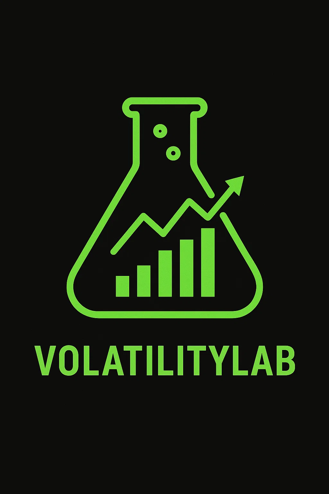

<p align="center">
  
</p>

A quantum trading platform for backtesting trading strategies on stocks and options.


## Features

- Simple web interface for backtesting and deploying strategies
- Explore a wide list of implemented strategies
- Currently supporting Alpaca API


## Getting Started

### Prerequisites
- Python 3.11+
- Node.js 16+
- Docker (optional)

### Installation

1. Clone the repository
```bash
git clone https://github.com/yourusername/VolatilityLab.git
cd VolatilityLab
```

2. Set up the backend
```bash
cd backend
python -m venv venv
source venv/bin/activate  # On Windows: .\venv\Scripts\activate (RUn this ---> Set-ExecutionPolicy Restricted -Scope CurrentUser) If previous command didnt work
pip install -r requirements.txt
```

3. Set up the frontend
```bash
cd frontend
npm install
```

4. Run with Docker
```bash
docker-compose up --build
```

## Development

### Backend
```bash
cd backend
uvicorn main:app --reload
```

### Frontend
```bash
cd frontend
npm start
```

## Environment Variables

Create a `.env` file in the backend directory with:
```
POLYGON_API_KEY=your_api_key_here
ALPACA_API_KEY=your_api_key_here
```

## License

MIT
